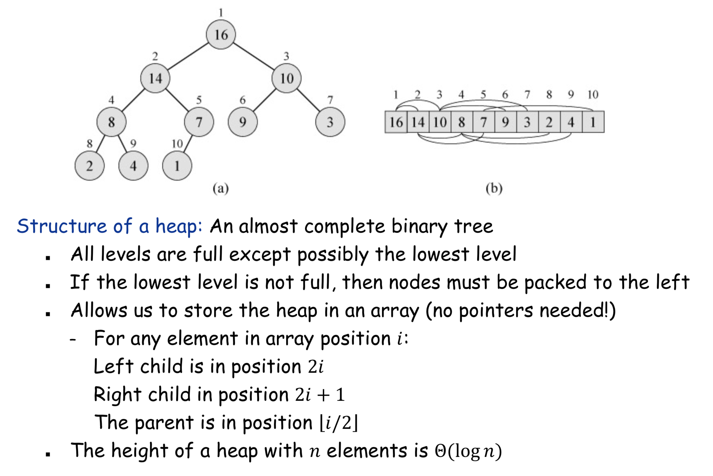
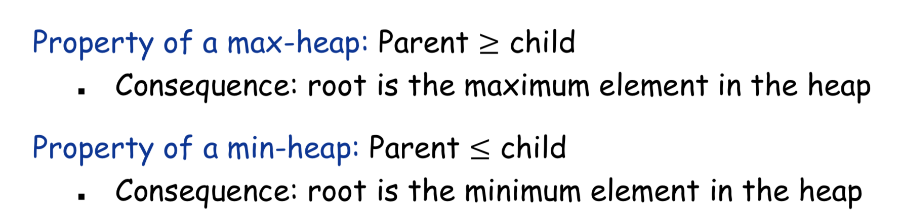
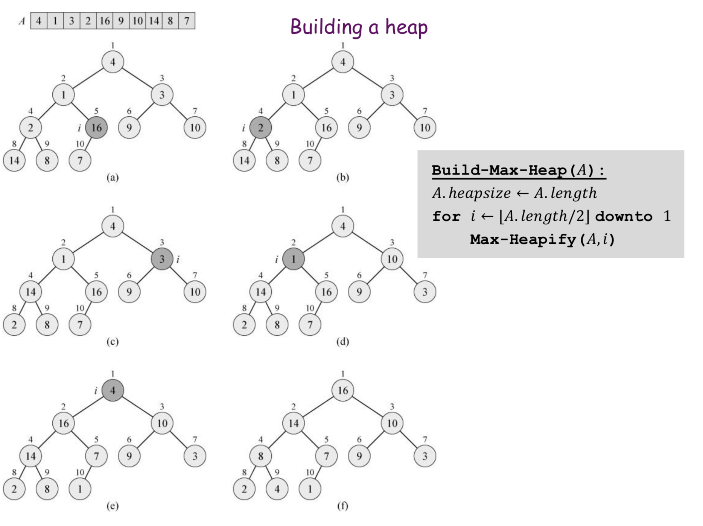
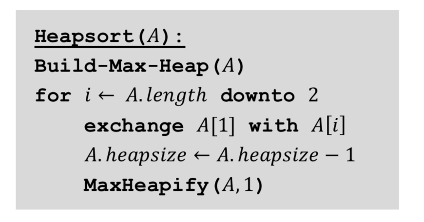
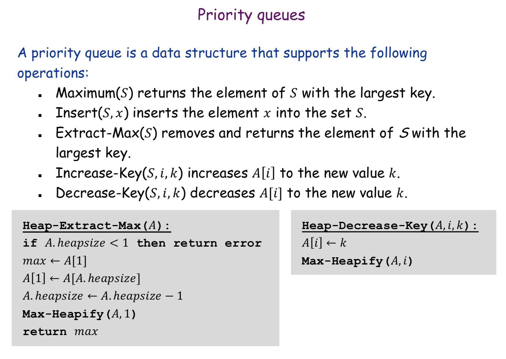
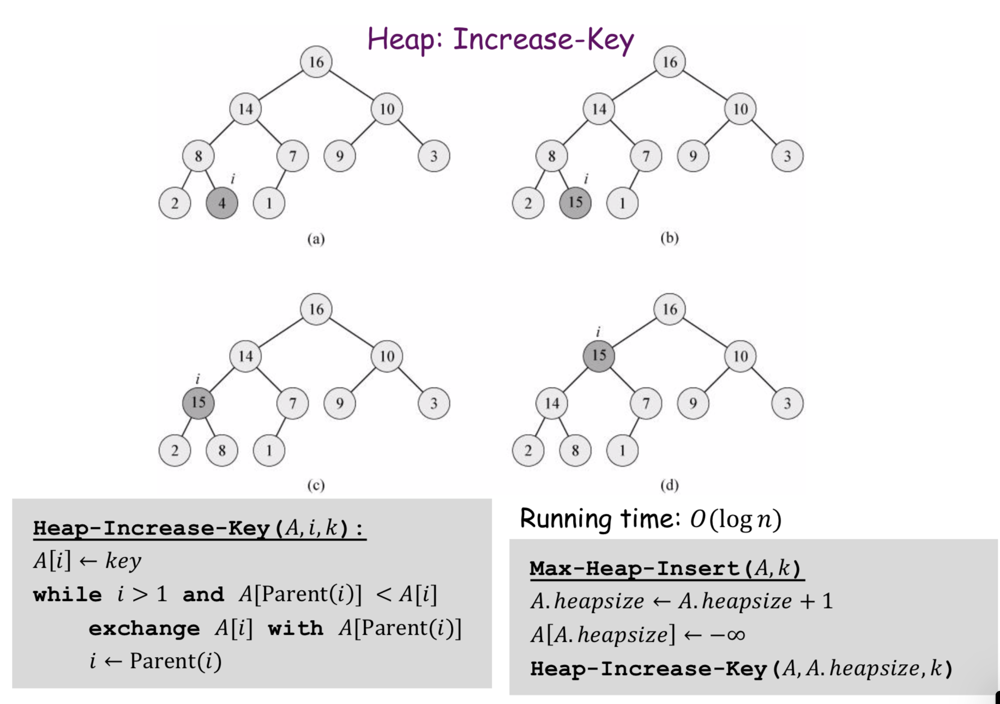

## Heap
- heapsort: O(nlogn) in place sorting
- priority queue is implemented using heap!

Why A.length / 2? 因為> A.length / 2的在最底層，可以被交換

why A.length downto 2?
A.length是最小的

| | Time
| Insert / Delete (heapify) | O(logn)
| Build a heap (at once; from an array) | O(n)
| Build a heap (insert element from the array one by one) | O(n*logn) <- heapify n times
| Heapsort | O(nlogn)
## Trie