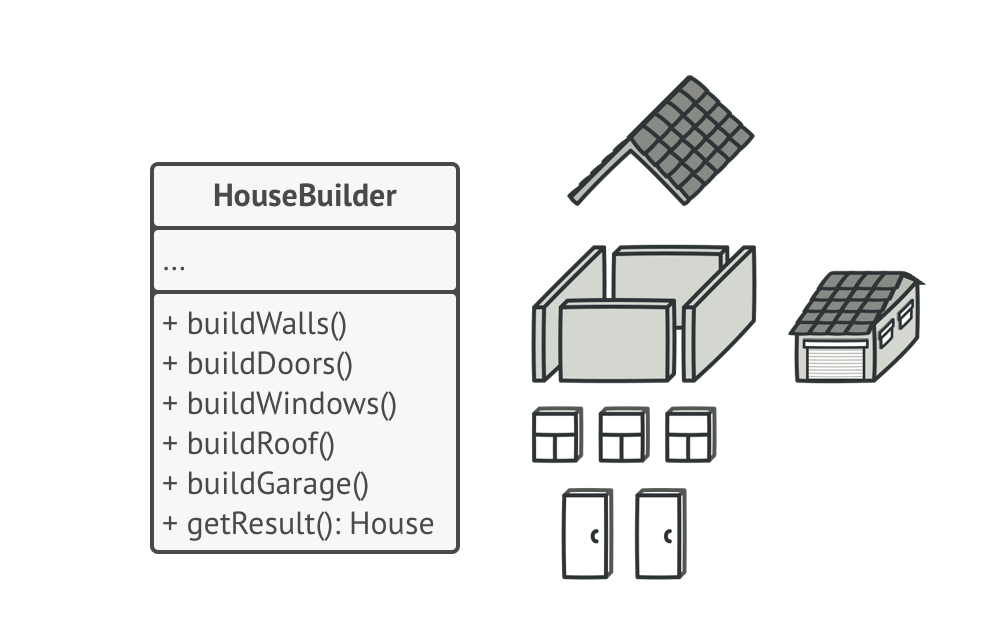
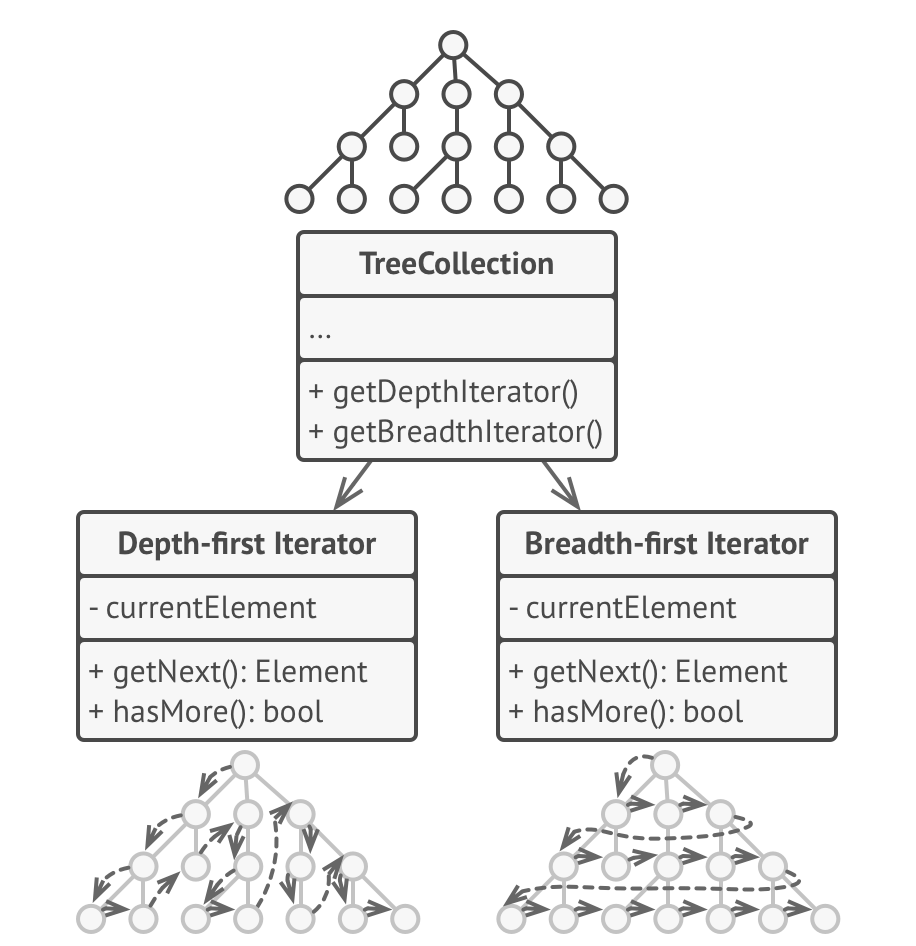
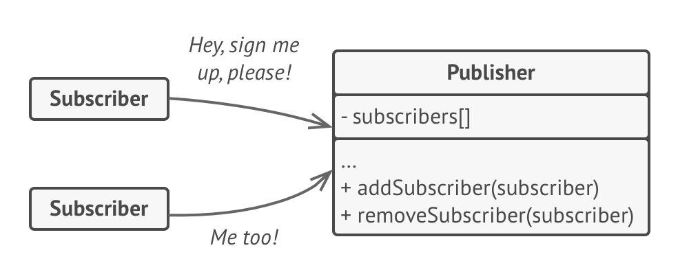
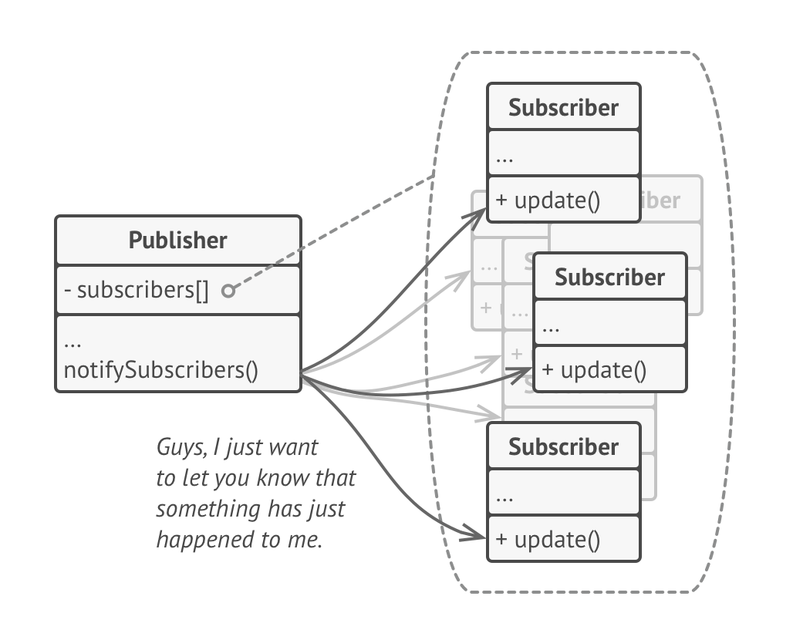

## OOP
### Access control
- public: Visible to the world
- protected: Variables, methods, and constructors, which are declared protected in a superclass can be accessed only
by **the subclasses in other package** or **any class within the package of the protected members' class**.
- package-private (default): Visible to the package
- private: Visible to the class
#### polymorphism
Key idea: polymorphism allows you to define one interface and have multiple implementations. 
- Compile time polymorphism
    - operator overloading
    - method **overloading**: multiple functions with same name but different parameters
- Run time polymorphism
    - method **overriding**: a derived class has a definition for one of the member functions of the base class.
#### Comparator
```
Comparator<int[]> arrayComparator = new Comparator<int[]>() {
    @Override
    public int compare(int[] o1, int[] o2) {
        return o1[0] - o2[0];
    }
};
Arrays.sort(intervals, arrayComparator); // sort by ascending order
```

## design patterns
https://refactoring.guru/design-patterns
- Creational Pattern
    - Factory pattern: provides an interface for creating objects in a superclass, but allows subclasses to alter the
    type of objects that will be created.
    
    - Builder pattern:  construct complex objects step by step. The pattern allows you to produce different types and
    representations of an object using the same construction code.
    
    - Singleton pattern: lets you ensure that a class has only one instance, while providing a global access point to
    this instance.
- Structural Pattern
    - Bridge pattern:  lets you split a large class or a set of closely related classes into two separate
    hierarchies—abstraction and implementation—which can be developed independently of each other.
    (key idea for Bridge pattern: **Contains**)
    
    
- Behavior Pattern
    - Iterator pattern: lets you traverse elements of a collection without exposing its underlying representation
    (list, stack, tree, etc.).
    
    - Observer pattern: lets you define a subscription mechanism to notify multiple objects about any events that happen
    to the object they’re observing.
    
    
                        

## Past questions
1. Java 和 C/C++ 比较有什么区别
2. Java 是怎么编译的, memory allocation是什么
compile: `javac FirstJavaProgram.java`
run: `java FirstJavaProgram`

3. ArrayList 和 LinkedList 有什么区别和应用

    - ArrayList: concept of dynamic array
        - insertion/removal: O(n) (risk of resizing array and copying content to new array if array gets full)

    - LinkedList: concept of doubly linked list
        - insertion/removal: O(1)
        - more memory overhead

    https://www.geeksforgeeks.org/arraylist-vs-linkedlist-java/

4. Hashtable & Hashmap的差別
    - HashMap
        - non synchronized (not-thread safe)
        - allows one null key and multiple null values
    - Hashtable
        - synchronized (thread-safe)
        - no null key or null values
        ```
        Hashtable<Integer,String> ht
            =new Hashtable<Integer,String>(); 
        ```
     https://www.geeksforgeeks.org/differences-between-hashmap-and-hashtable-in-java/
5. Hashtable 和 Hashmap怎么实现的，用什么数据结构
ANS: array (https://stackoverflow.com/questions/22215353/implementation-of-hashmap-data-structure-in-java)
6. TreeMap, HashMap and LinkedHashMap
    - HashMap: 
        - lookup, insertion: O(1)
        - the order of keys is arbitrary
        - implemented with array of linked list
    - LinkedHashMap
        - lookup, insertion: O(1)
        - the order of keys is based on insertion order
        - implemented with doubly-linked buckets
    - TreeMap
        - lookup, insertion: O(logn)
        - Keys are ordered
        - implemented with black-red tree
    https://www.geeksforgeeks.org/differences-treemap-hashmap-linkedhashmap-java/
7. Java garbage collection
8. MongoDB和MySQL的区别和优缺点
9. 怎么求MySQL里一共有多少行，写出命令expression
SELECT COUNT(*) FROM cities;
c.f.
db.collection.count()
db.collections.find({field1: <value>})
10. 解释 Left Join

11. REST API
client send request to server
server respond with the API result with http 